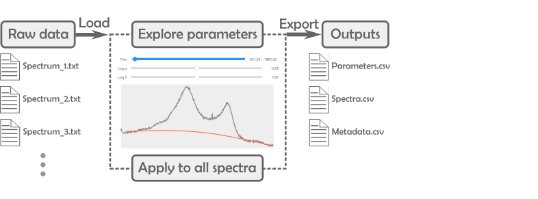

 
# PRISMA App

PRISMA is a Jupyter-based app for high-throughput analysis of spectra. The app addresses the need of researchers working in spectroscopy to analyze large numbers of spectra quickly, simply and reproducibly - whether they are code-savvy or not. PRISMA consists of both Python-based code for analysis of spectra and a user-friendly Graphical User Interface (GUI) built with the ipywidgets module. 

# License
* Which License to use?
    * My dependencies: python, numpy, scipy, bqplot, jupyter lab, ipywidgets

# Installation
## Users unfamiliar with Python
* First download and install [Miniconda](https://docs.conda.io/en/latest/miniconda.html). Miniconda is a Python distribution (Python + other useful tools) that enables to run Python code, manage and install third-party packages. Miniconda is conveninent to quickly set up everything you need to run Python programs, including PRISMA.
> **Note**: Make sure that Miniconda installs in the default folder `C:\Users\your_user_name\Miniconda3`. This will enable installing PRISMA smoothly.
* In this github page click on the green button *Code* and Download ZIP
* Unzip the file and open the folder. There you will find a bunch of files that contain code (prisma folder), documentation and examples (docs folder), scripts etc.
* Navigate to the manual_installation folder and double click *install_environment.bat* file. A terminal (small black window with Matrix-style fonts) will appear and run the commands automatically. Just wait until it closes alone. This file will automatically run the necessary commmands to set up PRISMA.  

Thats it! You are ready to go. To launch the app, go back to the main folder and double-click on *launch_prisma.bat*. A browser tab will open and load the app. You can click the same *launch_prisma.bat* file every time you wish to use the app.

**For Python-savvy users**   

While this is an operating version of PRISMA, we are still working in a stable version, i.e. without package incompatibilities, to release to Pypi. In the meantime, you can install PRISMA by:
* Cloning the repository (donwload it or `git clone`)
* Creating a conda environment based on the *requirements.yml* file. 
* Install prisma from the root directory (where the setup file is) using `pip install ./`
* If you wish to use the GUI as well, make sure to install a jupyter kernel using prisma. Run the following command after activating prisma's conda environment: `ipython kernel install --user --name=prisma`. After, open and run  the gui.ipynb notebook located in the ./gui directory. In the following links you can find more information about [jupyter kernels](https://ipython.readthedocs.io/en/stable/install/kernel_install.html) and [how to manage them](https://queirozf.com/entries/jupyter-kernels-how-to-add-change-remove).

>**Note:** Conda is used as environment manager and Python distribution because we found it to be the easiest way to install PRISMA in PCs with no admin rights, which is the case in many academic institutions. Some PCs do not even allow to install vanilla Python without admin rights. A compiled .exe is even more difficult to install. To our knowledge, there is no way easier than CONDA to go from developing Python source code to deploying in an user's PC; but we are always open to new ideas, developements and suggestions.

# Use: as an app
The general workflow to use the app consist of:
1. Select a pipeline, i.e. the type of analysis
2. Load raw data
3. Explore processing parameters
4. Apply optimal parameters to all spectra
5. Export the results  

The results are exported as .csv files ready for plotting.

# Use: as a package
We have created a jupyter notebook with examples of how to use all prisma functionalities as a package. You can find the examples and complete documentation in the [docs](./docs) directory.

# Cite

# Contact
Eibar Flores  
Technical University Denmark  
eibfl@dtu.dk

