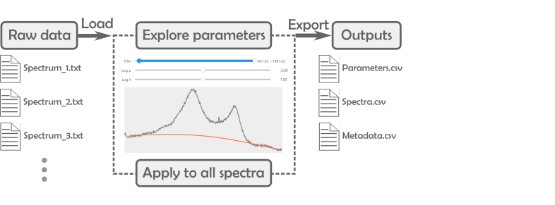

 
# PRISMA App

PRISMA is a Jupyter-based app for high-throughput analysis of spectra. The app addresses the need of researchers working in spectroscopy to analyze large numbers of spectra quickly, simply and reproducibly - whether they are code-savvy or not. PRISMA consists of both Python-based code for analysis of spectra and a user-friendly Graphical User Interface (GUI) built with the ipywidgets module. 

# License

# Installation
* DTU requirements to publish code?
* Which License to use?
    * My dependencies: python, numpy, scipy, bqplot, jupyter lab, ipywidgets

# Use
The general workflow to use the app consist of:
1. Select a pipeline, i.e. the type of analysis
2. Load raw data
3. Explore processing parameters
4. Apply optimal parameters to all spectra
5. Export the results  

The results are exported as .csv files ready for plotting.

# Code structure
PRIMSA code is built in three separate layers:
1. **The models**: main analysis code operating on spectrum objects, e.g. baseline correction, trimming, peak fitting, etc.  
2. **The views**: reusable GUI elements built with ipywidgets.
3. **The pipelines**: tailored code rendering a group of views together to create an app. The pipelines also control the flux of data between widgets and analysis code.  

Such structure enables reusing analysis code (the model) via external apps.  

The **models** are built around the `spectrum` object, which is determined by:  
* a vector of energies
* a vector of counts
* a dictionary of metadata  

Every analysis functionality takes as inputs a `spectrum` and parameters, and returns a new 'processed' `spectrum` object as output. All relevant parameters to reproduce the analysis (e.g. input parameters, side-results, etc.) are stored as metadata in the output spectrum.  
    

See the API documentation for more details.

# Cite

# Contact
Eibar Flores  
Technical University Denmark  
eibfl@dtu.dk

