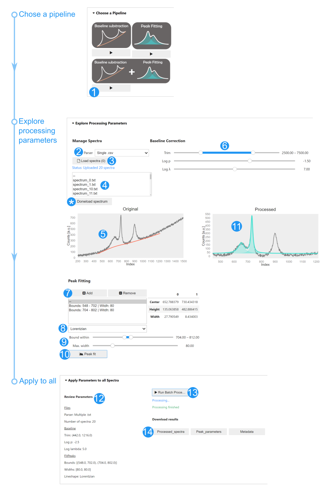

# PRISMA App use
The typical steps when using the app are:
1. Select a pipeline. We use the baseline substraction + peak fitting pipeline as example for illustration purposes.
2. Select a parser. Each parser reads spectra stored in a specific file format. Consult the [Documentation](./Documentation) to see the file formats accepted by each parser.
3. Load spectra. A File explorer appears so to select the spectra files. The explorer will only show the formats accepted by each parser. For instance, if Single .csv is chosen as parser (step 2), then the file explorer will only show csv files. Ensure you chose the right parser in order to find your spectra files.
4. Select a spectrum from the list.
5. Visualize the selected spectrum: raw datapoints in grey, baseline in orange.
6. Trim the spectrum to focus on a region of interest. Also change the baseline parameters to improve the baseline fit. Iterate between steps 5-6 to improve the fit.   
> Note: The sliders can be changed either by sliding the nodes, or by clicking the numbers at the end of the slider, typing your deisred number and pressing ENTER. 
7. Add peaks to model the baseline-substracted spectrum.
8. Select the type of curve profile.
9. Select a peak and modify its bound parameters. The peak fitting alogrithm will try fitting each peak within its bound region you choose, and with the maximum width you choose.
10. Run the peak fit.
11. Visualize the fitting results.  

> *Optional*: You can download samples (*), i.e. the currently selected spectrum, its baseline and peak fits. This is useful when you wish to plot individual spectra.

> *Iterations*: Repeat steps 4-11, updating the parameters, visualizing the results and improve the fit. Once your parameters seem to provide satisfactory results move to the next step.  

12. Go to the Apply to all tab and revise your parameters.
13. Run the high-throughput processing step. The app process each spectrum with the parameters you provided. This step might take seconds to minutes, depending on the number of spectra being processed.
14. Once the processing is completed, you can download the results as .csv files ready for plotting using your favourite software.  

  

# Troubleshooting
Here we summarize a list of possible issues we have identified when using the app, along with workarounds. To facilitate the description we make references each step of the App use guide above. Most issues can be solved with a 'Divide and Conquer' strategy.

## Step 3: Loading spectra  
### Error when loading  
The files you are attempting to upload do not comply with the supported formats described in the Documentation. You can:
* Open the files manually with a text editor (Notepad++ or default Notepad) and change the file manually to make it comply with the accepted formats (e.g. adding a white space, or deleting headings, etc).
* Alternatively, you can open files with a plotting software (e.g. Excel, Origin, etc), make manual changes there (e.g. adding headings, ensuring the first column is the index, etc.), and save again the data as a single .csv file that can be opened with the .csv parser.

### Files dont load  
Currently the ipywidgets interface have issues uploading files larger than 10 MB. This is a ongoing [issue](https://github.com/jupyter-widgets/ipywidgets/issues/2522) that we expect to correct in the near future. In the meantime 'Divide and Conquer': work with smaller sections of your spectra, one section at a time. Example, first process the wavelenght region between 400-500 nm, then from 600-750 nm and so on. To split your files in smaller regions, we reccommend:  
* Loading all your files with a plotting software (e.g. Excel, Origin, etc)
* Splitting all data into smaller wavelength regions in different sheets/workbooks
* Exporting each of the subsections as individual csv files, each lighter than 10 MB
* Analyze each subsection independently with PRISMA  

## Step 6: Baseline Correction
You might not be happy with the Assymetric Least Squares fit of the baseline; some regions might be underfitted (curve far from data) while other overfitted (curve too far into a peak). This happens because the baseline curvature might be very similar to the curvature of a broad peak and thus the algorithm has no way to distinguish what to your eyes seems obvious. We are currently working on implementing machine learning algorithms to improve in differentiating what is part of a baseline and what is not. In the meantime: 'Divide and Conquer':
* Split your region of interest into smaller regions using the Trimming (Step 6).
* Do the analysis one region at a time.

When your analysis region is more restricted to your peak of interestest, you have a better chance of observing a satisfactory baseline fit.

## Step 7: Adding Peaks for Fitting  
Sometimes when adding peak and bounds (Steps 7, 9) you might observe that the list of peaks is not updated, or you peak is not added. This happens because the peak you try to add has identical bound parameters to an exsitting peak. We reccommend:
*  First add the peak (Step 7)
* Then click on 'New Peak' on the box
* Last, change the bounds and widths ensuring the parameters do not repeat to an existing peak

## Step 10: Peak fit during parameter exploration
When the peak fit is succesful you can visualize the result (step 11) and the resulting fitting parameters next to the peak bounds box. However, the peak fit might not converge. While we optimized the parameters for peak fitting, we have osberved sporadic convergence failures when the the spectra is dense, i.e. it has many datapoints per peak (e.g. in case of some X-ray diffraction patterns).     

When convergence fails, a orange message appears suggesting possible fixes. You can try any of these:  
* *Using more peaks:* Using more peaks to fit might decrease the resuduals and improve the chances of convergence. 
* *Changing the lineshape:*  Changing among Gaussian, Lorentzian, Pseudo-Voigt to find a better model.                                           
* *Improving the width guesses/peak bounds:* The bounds you introduce are used to calculate initialization parameters for the fit. Finding the global minimum in the residual vs. parameters space (i.e. fitting) migth depend on the starting point of the search. Bottom-line, changing slightly your peak bounds and max width limits might improve convergence.
* *Narrowing the trim range:* Once again, 'Divide and Conquer'. Focus in a narrower region of your spectra, and analyze less peaks at a time. Smaller regions might be easier to fit.

## Step 13: Peak fit during batch processing
Convergence might fail during batch processing is some of your spectra dont converge. If this is the case, you will see a list of spectra that did not fit below the Batch Processing button. You will still be able to download and use the result files, but the fitting results and parameters will be empty for those files where convergence failed. We recommend:
* Load again your raw spectra and tune the trim, baseline and peak bounds the same as before (i.e. when you encountered convergence issues)
* In step 10, inspect the spectra that failed and try the fixes mentioned in the preceeding Issue (Step 10: Peak fit during parameter exploration).  
* Inspect more spectra, testing if you can fit them all with your modification.
* Run the batch processing (Step 13) to check if you still have issues. If you do, repeat the previous 2 steps iteratively.
> Note: This iterative fine tuning, i.e. moving multiple times between steps 4-11, is perhaps the most time-consuming part of working with PRISMA; however, in our experience is often successful and is seldomly needed. In any case, we are working on strategies to improve the success rate of convergence (e.g. improving the default bounds, subsampling the data, repeat the fit by re-initializing the parameters from a normal distribution constrained by the bounds), which we expect to update in followng versions.
