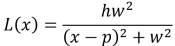
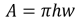
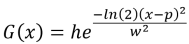
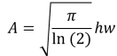
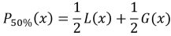
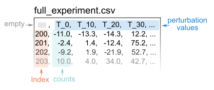
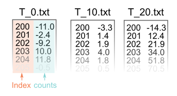
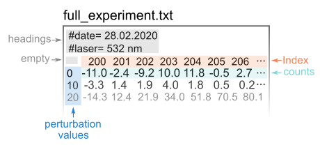
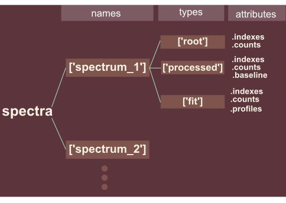

 
# PRISMA Documentation
PRISMA consist of a collection of spectrum-processing functions that operate over spectrum objects. In essence, the parsers load datasets into spectrum objects, that can be operated with the functions implemented. The functions output spectrum objects as well.


## Spectrum objects 
PRISMA supports three types of spectrum objects, all inheriting from a base `Spectrum` class. 


### Class Spectrum  
`Spectrum(indexes, counts, **kwargs)`  
The base spectrum class. Constructs spectrum objects. 
> **Arguments**
>* `indexes`: numpy 1D array. The vector of indexes of the spectrum (e.g. wavenumbers, energies, wavelenghts, diffraction angles, etc.)   
>* `counts`: numpy 1D array. The vector of corresponding counts (e.g. counts, counts/s, absorbance, etc.). Must have the same shape as indexes.    
>* `kwargs`: key=value pairs. Anotate the spectrum object with metadata (e.g. name = 'my_spectrum', time = 23, temperature = 45). If the value is a dict, the key:value pairs are unpacked as metadata records as well.  

>**Attributes**
>* `indexes`: numpy 1D array.  
>* `counts`: numpy 1D array.  
>* `metadata`: dict. Metadata annotations as key:value pairs. If the spectrum object is output from a process, the metadata contains the type of process and the input parameters used.  
>* `class_id`: dict. Name and identifiers of the class generating the object. The identifiers include support for Ontological URIs.


### Class SpectrumProcessed  
`SpectrumProcessed(indexes, counts, **kwargs)`  
A processed spectrum. Inherits from class Spectrum with additional properties generated during processing. The medatada of SpectrumProcessed object stores the analysis type and parameters used.  
>**Attributes inherited from Spectrum**


### Class SpectrumPeakfit  
`SpectrumPeakfit(indexes, counts, profiles, **kwargs)`  
A peak fitting of the spectrum. Inherits from class Spectrum with additional properties generated during processing. The medatada of the SpectrumPakfit object stores the both the fitting parameters and the resulting fitting coefficients.   
> **Arguments**
>* `profiles`: dict. Individual profile fitting a peak in the spectrum, as key:value pairs of {profile_number(int):numpy 1D array}.  

>**Attributes**
>* `profiles`: dict. Individual profile fitting a peak in the spectrum, as key:value pairs of {profile_number(int):numpy 1D array}.
>* Attributes inherited from Spectrum  


## Processing Modules
PRISMA functions are sorted into modules. Each module has a collection of functions that can be accessed with the dot notation. 


### Module Preprocessing  
`import prisma.preprocessing`  
Functions that modify the raw spectrum, e.g. smooting, outlier removal, trimming, etc. The functions currently implemented:
#### Trimming
`prisma.preprocessing.trimming(spectrum, within)`  
Trims the input spectrum within a range.  
> **Arguments**
>* `spectrum`: spectrum object used as input.
>* `within`: [float,float]. The range defining where the spectrum is trimmed.  

>**Returns**: `Spectrum` object (trimmed)  


### Module Baselines  
`import prisma.baselines`
Functions that fit a baseline to a spectrum and return a baseline-corrected spectrum.
#### Asymmetric Least Squares
`prisma.baselines.asymmetric_least_squares(spectrum, log_p, log_lambda)`  
Finds an baseline curve for the spectrum using the assymetric least squares method of Eilers and Boelens.  
> **Arguments**
>* `spectrum`: spectrum object used as input.
>* `log_p`: float. Controls the weight given to datapoints with low counts (likely to belong to the baseline).    
>* `log_lambda`: float. Controls the degree of smoothness of the baseline curve.

>**Returns**: `SpectrumProcessed` object (baseline corrected)  


### Module Fitpeaks  
`import prisma.fitpeaks`  
Function that models a spectrum as a set of overlapping curves with defined lineshape (analytical expression) and parameters.  
#### Fit Peaks
`prisma.fitpeaks.fit_peaks(spectrum, peak_bounds, guess_widhts, lineshape)`  
Fit a spectrum with a set of overlapping profiles. 
> **Arguments**
>* `spectrum`: spectrum object used as input.
>* `peak_bounds`: list of 2-tuples of floats. Sets the lower and upper bound for the position of each peak. E.g. `[(10,30),(40,60)]` bounds the index of the first profile between 10 and 30, and the index of the second profile between 40 and 60. NOTE: len(peak_bounds) must be equal to len(guess_widths)   
>* `guess widths`: list of floats. Provides an initial guess of maximum profile widths. E.g. `[20, 50]` initialize the fitting with two profiles, one constrained to a widht of 20 index units and other with 50 index units. NOTE: len(peak_bounds) must be equal to len(guess_widths)   
>* `lineshape`" str. Lineshape of the profiles. Currently available: 'Lorentzian', 'Gaussian', 'Pseudo-Voight 50% Lorentzian'.  

>**Returns**: `SpectrumPeakfit` object (counts are the sum of the overlapping profiles)


### Module Lineshapes
`import prisma.lineshapes`  
Function generators according to a linehsape. Each function generator constructs lambda functions by evaluating strings. The generator 
returns a function of a number of profiles. The returned function is: `returned_function(x, y0, h1, p1, w1, h2, p2, w2 ,h3 ,p3 ,w3...)`, where y0 is the intercept and hn, pn, wn correond to the height, position and width of the n-th peak.  These functions can be used to generate, e.g. synthetic spectra.
#### Lorentzians
`prisma.lineshapes.lorentzians(npeaks)`  
Generate a function of npeaks number of lorenztian profiles.  The lorentz profile is described by the analytical expression  

   

where *h, p, w* represent the height, position and half-width at half maximum of the profile, respectively. The area can be calculated as    

> **Arguments**
>* `npeaks`: Number of lorentzian curves.  

>**Returns**: `function` that takes as inputs an array of indexes (x: numpy array) and the parameters of the lorentzian curves (y0, h1, p1, w1).  

#### Gaussians
`prisma.lineshapes.lorentzians(npeaks)`  
Generate a function of npeaks number of gaussian profiles.  The gaussian profile is described by the analytical expression:  
  
where *h, p, w* represent the height, position and half-width at half maximum of the profile, respectively. The area can be calculated as   

> **Arguments**
>* `npeaks`: Number of lorentzian curves.  

>**Returns**: `function` that takes as inputs an array of indexes (x: numpy array) and the parameters of the gaussian curves (y0, h1, p1, w1). 

#### Pseudo-Voight: 50% Lorentzian
`prisma.lineshapes.pseudo_voight_50(npeaks)`  
Generate a function of npeaks number of pseudo-voight profiles (50% Lorentzian).  The pseudo-voight profile is described by the analytical expression:  
   
> **Arguments**
>* `npeaks`: Number of pseudo-voight curves.  

>**Returns**: `function` that takes as inputs an array of indexes (x: numpy array) and the parameters of the pseudo-voight curves (y0, h1, p1, w1). 

Example of using the lineshapes to generate data:  
```
import numpy as np

x = np.arange(200,1500,2)
n_profiles = 3
intercept = 0
params1 = [200,650,50] #Parameters of first curve 
params2 = [500,730,10]
params3 = [300,900,20]

my_lorentzian_function = prisma.lineshapes.lorentzians(n_profiles)
y_array = my_lorentzian_function(x, intercept, *params1, *params2, *params3)
```


### Module Parsers
`import prisma.parsers`
Functions that load spectra data files (.txt, .csv) into spectrum objects. 


#### Single .csv  
`prisma.parsers.single_csv(bitstream)`  
Reads a bitstream from a single .csv file containing all spectra. The .csv file must follow a format where the first column contains the index, and the successive columns the count columns labelled with the spectra names or perturbation values (e.g. temperature, time, position, voltage). For instance:  

> **Arguments**
>* `bitstream`: string. Bitstream representing the content of the .csv file.  The data is passed as bitstreams in order to support GUIs (and potentially web APIs) using the system's File explorer to load the files. When passing the content of a file ensure is opened in byte format ; see sniped below.

>**Returns**:  
>* `spectra`: dict. Dictionary of spectrum_label:spectrum object pairs 
>* `metadata`: dict. Dictionary of parameter:value pairs. E.g. `{'Number of spectra':200, 'Highest wavenumber: 1000}`   
Example snippet to load files:  
```
file_path = r'./my_directory/my_dataset.csv' 
with open(file_path, mode='rb') as file:`  
    spectra, spectra_metadata = prisma.parsers.single_csv(file.read())
```


#### Multiple .txt
`prisma.parsers.multiple_txt(bitstream)`  
Reads the bitstream from multiple .txt files.  Each .txt file must follow a format where the indexes and counts are presented as a first and second column of numerical values. the columns must not be labelled. The filename is used as perturbation value (e.g. temperature, time, position, voltage). For instance:  

> **Arguments**
>* `upload`: dictionary of label:bistream pairs representing the content of each .txt file.  

>**Returns**:  
>* `spectra`: dict. Dictionary of spectrum_label:spectrum object pairs. The filenames are used as labels. 
>* `metadata`: dict. Dictionary of parameter:value pairs. E.g. `{'Number of spectra':200, 'Highest wavenumber: 1000}`    

Example snippet to load files:  
```
import os #Read filenames in a directory
file_path = r'./my_directory/'
binary_text_files = {}

for filename in os.listdir(file_path): #Create dictionary of filename:bitstream pairs
    with open(file_path+filename, mode='rb') as file:
        binary_text_files[filename] = file.read() 

spectra, spectra_metadata = prisma.parsers.multiple_txt(binary_text_files)
```

#### Single .txt (from Bruker instruments)
`prisma.parsers.single_txt_bruker(bitstream)`  
Reads the bitstream from a .txt file and generates spectrum objects. This parser is tailored to files exported from Bruker spectrometers, but any single txt file complying with the format can be read. The file starting from instrument parameters labelled with hashtags, followed by a row of wavenumbers, and successive rows of counts whose first value is the perturbation value (e.g. time, temperature, voltage, etc.):  

> **Arguments**
>* `bitstream`: string. Bitstream representing the content of the .txt file. The .txt file follows previously illustrated format format, 

>**Returns**:  
>* `spectra`: dict. Dictionary of spectrum_label:spectrum object pairs. The time values (first column) are used as labels. 
>* `metadata`: dict. Dictionary of parameter:value pairs. E.g. `{'Number of spectra':200, 'Highest wavenumber: 1000}`

Example snippet to load files:  
```
file_path = r'./my_directory/my_dataset.txt' 
with open(file_path, mode='rb') as file:`  
    spectra, spectra_metadata = prisma.parsers.single_txt(file.read())
```


**Note:** All parsers output two dictionaries: the spectra and its metadata. Here is a schema of how to access the attributes:  
  
* The parser's output - spectra - is a dictionary whose keys correspond to individual spectrum names (the filenames of individual txt files, or headings of the single csv file)
* Each name accesses itself a dictionary, storing three types of `Spectrum` objects:  
    * *root*: the original upload  
    * *processed*: after baseline correction
    * *fit*: after peak fitting.  

In addition of the three main objects, you can of course add more keys to specify different operations.  

```python

```
